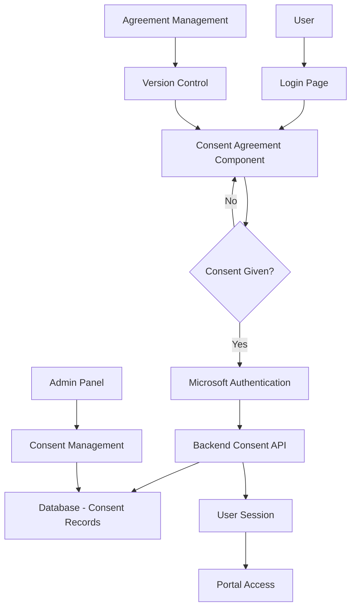
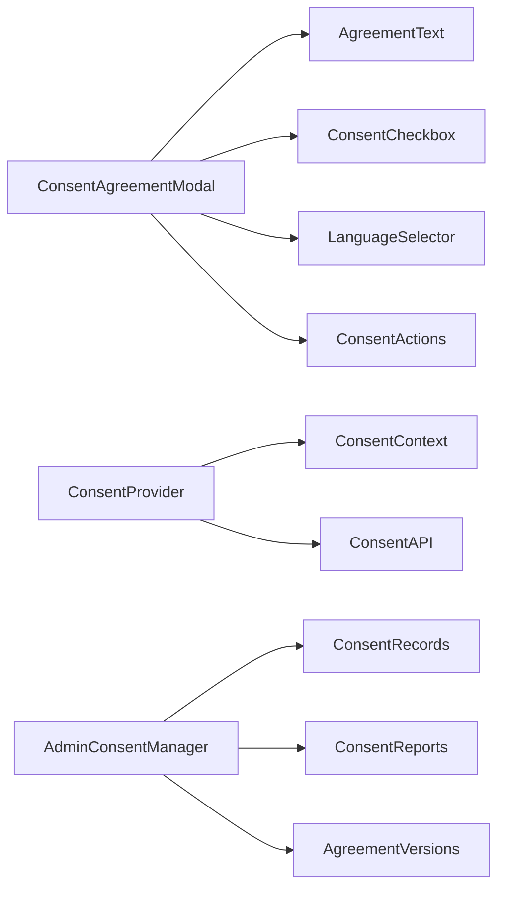

# User Consent Agreement System - Design Document

## Overview

The User Consent Agreement system is a comprehensive solution that ensures legal compliance with data protection regulations (GDPR, DPDP Act 2023) while providing a seamless user experience. The system intercepts the authentication flow to present users with a detailed consent agreement that must be accepted before portal access is granted.

## Architecture

### High-Level Architecture



### Component Architecture



## Components and Interfaces

### Frontend Components

#### 1. ConsentAgreementModal Component
```typescript
interface ConsentAgreementModalProps {
  isOpen: boolean;
  onConsentChange: (consented: boolean) => void;
  onClose: () => void;
  agreementVersion: string;
  selectedLanguage: string;
}

interface ConsentState {
  hasConsented: boolean;
  consentTimestamp: Date | null;
  agreementVersion: string;
  language: string;
}
```

#### 2. AgreementText Component
```typescript
interface AgreementTextProps {
  content: AgreementContent;
  language: string;
  version: string;
}

interface AgreementContent {
  title: string;
  sections: AgreementSection[];
  effectiveDate: string;
  version: string;
}

interface AgreementSection {
  id: string;
  title: string;
  content: string;
  subsections?: AgreementSection[];
}
```

#### 3. ConsentProvider Context
```typescript
interface ConsentContextValue {
  consentStatus: ConsentStatus;
  checkConsentStatus: () => Promise<ConsentStatus>;
  recordConsent: (agreementVersion: string, language: string) => Promise<void>;
  withdrawConsent: () => Promise<void>;
  isLoading: boolean;
  error: string | null;
}

interface ConsentStatus {
  hasValidConsent: boolean;
  consentDate: string | null;
  agreementVersion: string | null;
  language: string | null;
  requiresNewConsent: boolean;
}
```

### Backend API Interfaces

#### 1. Consent API Endpoints
```typescript
// POST /api/consent/record
interface RecordConsentRequest {
  agreementVersion: string;
  language: string;
  ipAddress: string;
  userAgent: string;
}

interface RecordConsentResponse {
  success: boolean;
  consentId: string;
  timestamp: string;
}

// GET /api/consent/status
interface ConsentStatusResponse {
  hasValidConsent: boolean;
  consentDate: string | null;
  agreementVersion: string | null;
  language: string | null;
  currentVersion: string;
  requiresNewConsent: boolean;
}

// POST /api/consent/withdraw
interface WithdrawConsentRequest {
  reason?: string;
}

// GET /api/consent/agreement/:version?
interface AgreementResponse {
  content: AgreementContent;
  version: string;
  effectiveDate: string;
  languages: string[];
}
```

#### 2. Admin API Endpoints
```typescript
// GET /api/admin/consent/records
interface ConsentRecordsResponse {
  records: ConsentRecord[];
  pagination: PaginationInfo;
}

interface ConsentRecord {
  id: string;
  userId: string;
  userName: string;
  userEmail: string;
  consentDate: string;
  agreementVersion: string;
  language: string;
  ipAddress: string;
  status: 'active' | 'withdrawn';
  withdrawalDate?: string;
}

// GET /api/admin/consent/reports
interface ConsentReportsResponse {
  totalUsers: number;
  consentedUsers: number;
  pendingConsent: number;
  withdrawnConsent: number;
  complianceRate: number;
  versionBreakdown: VersionStats[];
}
```

## Data Models

### Database Schema

#### 1. user_consents Table
```sql
CREATE TABLE user_consents (
    id UUID PRIMARY KEY DEFAULT gen_random_uuid(),
    user_id UUID NOT NULL REFERENCES users(id),
    agreement_version VARCHAR(50) NOT NULL,
    language VARCHAR(10) NOT NULL DEFAULT 'en',
    consent_date TIMESTAMP WITH TIME ZONE NOT NULL DEFAULT NOW(),
    ip_address INET,
    user_agent TEXT,
    status VARCHAR(20) NOT NULL DEFAULT 'active',
    withdrawal_date TIMESTAMP WITH TIME ZONE,
    withdrawal_reason TEXT,
    created_at TIMESTAMP WITH TIME ZONE DEFAULT NOW(),
    updated_at TIMESTAMP WITH TIME ZONE DEFAULT NOW()
);

CREATE INDEX idx_user_consents_user_id ON user_consents(user_id);
CREATE INDEX idx_user_consents_status ON user_consents(status);
CREATE INDEX idx_user_consents_version ON user_consents(agreement_version);
```

#### 2. agreement_versions Table
```sql
CREATE TABLE agreement_versions (
    id UUID PRIMARY KEY DEFAULT gen_random_uuid(),
    version VARCHAR(50) NOT NULL UNIQUE,
    content JSONB NOT NULL,
    effective_date TIMESTAMP WITH TIME ZONE NOT NULL,
    is_current BOOLEAN NOT NULL DEFAULT false,
    created_by UUID REFERENCES users(id),
    created_at TIMESTAMP WITH TIME ZONE DEFAULT NOW()
);

CREATE INDEX idx_agreement_versions_current ON agreement_versions(is_current);
CREATE INDEX idx_agreement_versions_effective ON agreement_versions(effective_date);
```

#### 3. consent_audit_log Table
```sql
CREATE TABLE consent_audit_log (
    id UUID PRIMARY KEY DEFAULT gen_random_uuid(),
    user_id UUID REFERENCES users(id),
    action VARCHAR(50) NOT NULL, -- 'consent_given', 'consent_withdrawn', 'consent_viewed'
    agreement_version VARCHAR(50),
    ip_address INET,
    user_agent TEXT,
    timestamp TIMESTAMP WITH TIME ZONE DEFAULT NOW(),
    details JSONB
);

CREATE INDEX idx_consent_audit_user ON consent_audit_log(user_id);
CREATE INDEX idx_consent_audit_action ON consent_audit_log(action);
CREATE INDEX idx_consent_audit_timestamp ON consent_audit_log(timestamp);
```

## Error Handling

### Frontend Error Handling
```typescript
enum ConsentErrorType {
  NETWORK_ERROR = 'NETWORK_ERROR',
  VALIDATION_ERROR = 'VALIDATION_ERROR',
  SERVER_ERROR = 'SERVER_ERROR',
  CONSENT_REQUIRED = 'CONSENT_REQUIRED',
  AGREEMENT_NOT_FOUND = 'AGREEMENT_NOT_FOUND'
}

interface ConsentError {
  type: ConsentErrorType;
  message: string;
  details?: any;
}
```

### Backend Error Responses
```typescript
interface ErrorResponse {
  error: string;
  message: string;
  code: string;
  details?: any;
}

// Common error codes
const CONSENT_ERRORS = {
  CONSENT_REQUIRED: 'CONSENT_001',
  INVALID_VERSION: 'CONSENT_002',
  ALREADY_CONSENTED: 'CONSENT_003',
  WITHDRAWAL_FAILED: 'CONSENT_004',
  AGREEMENT_NOT_FOUND: 'CONSENT_005'
};
```

## Testing Strategy

### Unit Testing
- **Frontend Components**: Test consent modal, agreement display, checkbox functionality
- **Backend APIs**: Test consent recording, status checking, withdrawal process
- **Database Operations**: Test CRUD operations for consent records
- **Validation Logic**: Test agreement version validation, consent status checks

### Integration Testing
- **Authentication Flow**: Test consent integration with Microsoft authentication
- **API Integration**: Test frontend-backend consent API communication
- **Database Integration**: Test consent data persistence and retrieval
- **Admin Features**: Test consent management and reporting features

### End-to-End Testing
- **Complete Consent Flow**: Test full user journey from login to consent to portal access
- **Consent Withdrawal**: Test complete withdrawal process and access revocation
- **Admin Management**: Test admin consent management and reporting features
- **Multi-language Support**: Test agreement display in different languages

### Compliance Testing
- **GDPR Compliance**: Verify consent recording, withdrawal, and data handling
- **DPDP Act Compliance**: Ensure compliance with Indian data protection requirements
- **Audit Trail**: Test complete audit logging and reporting capabilities
- **Data Retention**: Test consent data retention and deletion policies

## Security Considerations

### Data Protection
- **Encryption**: All consent data encrypted at rest and in transit
- **Access Control**: Role-based access to consent management features
- **Audit Logging**: Complete audit trail for all consent-related actions
- **Data Minimization**: Only collect necessary consent-related data

### Privacy Measures
- **Consent Granularity**: Clear, specific consent for different data uses
- **Withdrawal Rights**: Easy consent withdrawal with immediate effect
- **Data Portability**: Export consent records in standard formats
- **Retention Policies**: Automatic deletion of expired consent records

### Technical Security
- **Input Validation**: Validate all consent-related inputs
- **Rate Limiting**: Prevent abuse of consent APIs
- **Session Management**: Secure consent state in user sessions
- **CSRF Protection**: Protect consent forms from cross-site attacks

## Performance Considerations

### Frontend Performance
- **Lazy Loading**: Load agreement content on demand
- **Caching**: Cache agreement versions in browser storage
- **Compression**: Compress large agreement text content
- **Progressive Loading**: Show agreement sections progressively

### Backend Performance
- **Database Indexing**: Optimize queries with appropriate indexes
- **Caching**: Cache current agreement versions in memory
- **Batch Processing**: Handle bulk consent operations efficiently
- **Connection Pooling**: Optimize database connections

### Scalability
- **Horizontal Scaling**: Design APIs to support multiple instances
- **Database Sharding**: Plan for consent data growth
- **CDN Integration**: Serve agreement content from CDN
- **Monitoring**: Track consent system performance metrics

## Deployment Strategy

### Database Migration
```sql
-- Migration script for consent system
-- Run in transaction to ensure atomicity
BEGIN;

-- Create tables
-- (Table creation scripts from Data Models section)

-- Insert initial agreement version
INSERT INTO agreement_versions (version, content, effective_date, is_current, created_at)
VALUES ('1.0.0', '{"agreement_content_json"}', NOW(), true, NOW());

-- Create admin permissions
INSERT INTO permissions (name, description)
VALUES ('consent.manage', 'Manage user consent records and agreements');

COMMIT;
```

### Environment Configuration
```typescript
interface ConsentConfig {
  CONSENT_REQUIRED: boolean;
  DEFAULT_LANGUAGE: string;
  SUPPORTED_LANGUAGES: string[];
  AGREEMENT_VERSION: string;
  CONSENT_EXPIRY_DAYS: number;
  AUDIT_RETENTION_DAYS: number;
}
```

### Feature Flags
- `CONSENT_SYSTEM_ENABLED`: Enable/disable entire consent system
- `MULTI_LANGUAGE_SUPPORT`: Enable multiple language support
- `CONSENT_WITHDRAWAL`: Enable consent withdrawal feature
- `ADMIN_CONSENT_MANAGEMENT`: Enable admin consent management

This design provides a comprehensive, compliant, and user-friendly consent management system that integrates seamlessly with the existing portal architecture while ensuring legal compliance and maintaining excellent user experience.