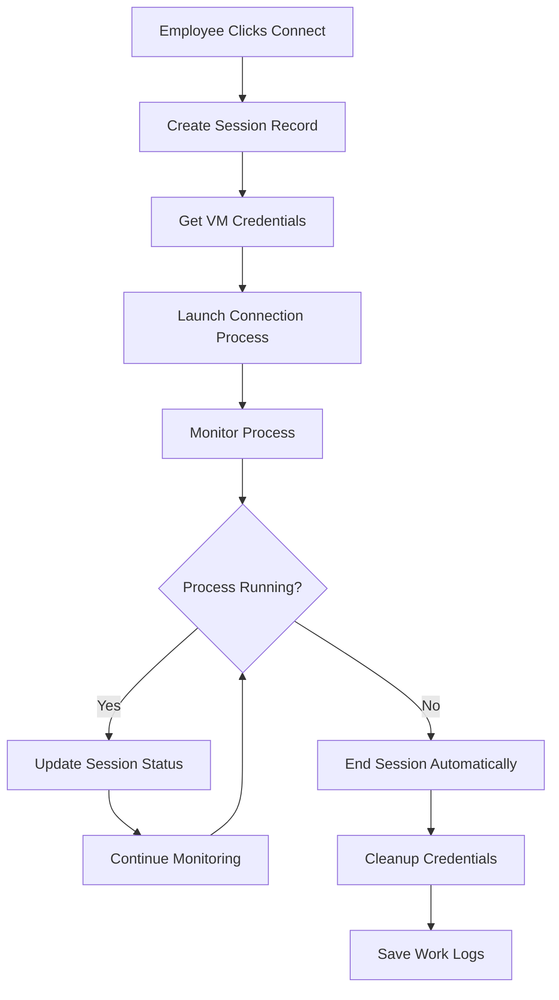

# Automated VM Connections Without Azure Bastion

## Overview

This document describes the automated VM connection system that allows employees to connect to virtual machines with one click, without requiring Azure Bastion subscription. The system automatically handles credentials, tracks usage, and monitors session lifecycle.

## Features

### 🚀 **One-Click Connection**
- Employee clicks "Work with VM" button
- VM connection launches automatically in their default client
- No manual credential entry required
- No file downloads or script execution needed

### 🔐 **Credential Protection**
- VM credentials never exposed to employees
- Credentials stored encrypted in database
- Automatic credential injection into connection clients
- Automatic cleanup after session ends

### 📊 **Automatic Usage Tracking**
- Session start/end automatically detected
- Process monitoring for connection lifecycle
- Work hours automatically logged
- Session duration calculated in real-time

### 🖥️ **Multi-Platform Support**
- Windows: RDP via mstsc, SSH via OpenSSH/PuTTY
- macOS: RDP via built-in client, SSH via Terminal
- Linux: RDP via rdesktop/freerdp, SSH via terminal

## Architecture

### Backend Components

1. **BrowserConnectionService** (`backend/src/services/browserConnectionService.js`)
   - Launches VM connections automatically
   - Monitors connection processes
   - Handles session lifecycle management

2. **Enhanced Session Model** (`backend/src/models/Session.js`)
   - Tracks process information
   - Monitors connection status
   - Automatic session cleanup

3. **Connection Controller** (`backend/src/controllers/connectionController.js`)
   - New endpoints for browser-based connections
   - Real-time status monitoring
   - Force session termination

### Frontend Components

1. **BrowserConnectionStatus** (`frontend/src/components/vm/BrowserConnectionStatus.jsx`)
   - Real-time connection status display
   - Session duration tracking
   - Manual session termination option

2. **Enhanced MyVMs** (`frontend/src/components/employee/MyVMs.jsx`)
   - Active connection management
   - Integrated status monitoring
   - Automatic updates when sessions change

## How It Works

### Connection Flow

1. **Employee Clicks "Work with VM"**
   ```
   Employee → ConnectionModal → "Connect Now" → API Call
   ```

2. **Backend Processing**
   ```
   API → ConnectionService → BrowserConnectionService → Launch Process
   ```

3. **Automatic Launch**
   ```
   RDP: cmdkey + mstsc (Windows) or open (macOS)
   SSH: sshpass + ssh or Terminal.app/gnome-terminal
   ```

4. **Process Monitoring**
   ```
   Process Events → Session Updates → Database → Frontend Updates
   ```

### Session Lifecycle



### Credential Security

1. **Storage**: Credentials encrypted in database using AES-256
2. **Access**: Only backend service can decrypt credentials
3. **Injection**: Credentials temporarily stored in OS credential manager
4. **Cleanup**: Credentials automatically removed after session ends

## Configuration

### Environment Variables

```bash
# Backend configuration
ENABLE_BROWSER_CONNECTIONS=true
AUTO_LAUNCH_CONNECTIONS=true
SESSION_MONITORING=true
CONNECTION_TIMEOUT_HOURS=8
PROCESS_MONITORING_INTERVAL=30000
SESSION_CLEANUP_INTERVAL=300000
```

### Platform Requirements

#### Windows
- Built-in mstsc (RDP client)
- OpenSSH client (Windows 10/11 optional feature)
- Windows Credential Manager

#### macOS
- Built-in RDP support
- Built-in SSH client
- Optional: sshpass (`brew install sshpass`)

#### Linux
- RDP client: `rdesktop` or `freerdp`
- SSH client: `openssh-client`
- Password auth: `sshpass`

## API Endpoints

### New Endpoints

```
POST /api/connections/initiate
- Initiates browser-based VM connection
- Auto-launches connection client
- Returns session information

GET /api/connections/:sessionId/browser-status
- Returns real-time connection status
- Includes process monitoring information

POST /api/connections/:sessionId/force-end
- Forcefully terminates connection
- Cleans up resources and credentials
```

### Response Examples

#### Connection Initiation
```json
{
  "success": true,
  "session": {
    "sessionId": "session_1672531200000_abc123",
    "vmId": 1,
    "connectionType": "rdp",
    "processId": 12345,
    "autoLaunched": true
  },
  "connectionInfo": {
    "type": "rdp",
    "autoLaunched": true,
    "processId": 12345,
    "message": "RDP connection launched automatically"
  }
}
```

#### Status Check
```json
{
  "success": true,
  "status": "active",
  "processRunning": true,
  "session": {
    "sessionId": "session_1672531200000_abc123",
    "duration": 45,
    "metadata": {
      "processId": 12345,
      "processStatus": "running"
    }
  }
}
```

## Security Considerations

### Credential Protection
- VM credentials are never sent to frontend
- Temporary credential storage is automatically cleaned up
- Audit logs track all credential access

### Process Security
- Connection processes run with user privileges
- No elevated permissions required
- Process isolation prevents credential leakage

### Network Security
- All API communication over HTTPS
- JWT token authentication required
- Session-based access control

## Monitoring & Logging

### Automatic Monitoring
- Process lifecycle tracking
- Session duration measurement
- Connection health checks every 30 seconds

### Audit Logs
```
CONNECTION_INITIATED - When connection starts
RDP_AUTO_LAUNCHED - When RDP client launches
SSH_AUTO_LAUNCHED - When SSH client launches
SESSION_AUTO_ENDED - When session ends automatically
CREDENTIALS_ACCESSED - When VM credentials are retrieved
```

### Work Log Integration
- Session start/end times automatically recorded
- Work hours calculated from session duration
- Integration with existing productivity tracking

## Troubleshooting

### Common Issues

1. **Connection Fails to Launch**
   - Check if RDP/SSH client is installed
   - Verify VM credentials are configured
   - Check network connectivity to VM

2. **Session Not Ending Automatically**
   - Process monitoring may have failed
   - Use "Force End Session" button
   - Check backend logs for process errors

3. **Credentials Not Working**
   - Verify VM credentials are correct in admin panel
   - Check if VM allows the authentication method
   - Ensure VM is accessible from current network

### Debug Commands

```bash
# Check if RDP client is available (Windows)
where mstsc

# Check if SSH client is available
which ssh

# Check if sshpass is available (for password auth)
which sshpass

# Check active sessions
curl -H "Authorization: Bearer $TOKEN" \
  http://localhost:3001/api/connections/active
```

## Benefits vs Azure Bastion

| Feature | Azure Bastion | This Solution |
|---------|---------------|---------------|
| Cost | $140+/month | Free |
| Setup | Complex Azure config | Simple deployment |
| Credentials | Manual entry | Automatic injection |
| Tracking | Limited | Full lifecycle |
| Client Support | Browser only | Native clients |
| Performance | Browser-based | Native performance |
| Offline Work | Not supported | Works offline |

## Deployment

### Quick Start

1. **Start Backend with Automation**
   ```bash
   cd backend
   ./scripts/start-automated-vm-portal.sh
   ```

2. **Configure VM Credentials**
   - Add VMs in admin panel
   - Set connection credentials
   - Assign VMs to employees

3. **Test Connection**
   - Employee logs in
   - Goes to "My VMs"
   - Clicks "Work with VM"
   - Connection launches automatically

### Production Deployment

1. **Environment Setup**
   ```bash
   export ENABLE_BROWSER_CONNECTIONS=true
   export AUTO_LAUNCH_CONNECTIONS=true
   export SESSION_MONITORING=true
   ```

2. **Platform Dependencies**
   - Install required RDP/SSH clients
   - Configure credential managers
   - Set up process monitoring

3. **Security Configuration**
   - Enable HTTPS
   - Configure JWT secrets
   - Set up audit logging

## Future Enhancements

### Planned Features
- Mobile app support
- VPN integration
- Multi-factor authentication
- Session recording
- Performance analytics

### Integration Options
- Azure AD authentication
- LDAP/Active Directory
- SSO providers
- Monitoring systems

## Support

For issues or questions:
1. Check troubleshooting section
2. Review backend logs in `logs/` directory
3. Check browser console for frontend errors
4. Verify platform requirements are met

---

**Note**: This solution provides enterprise-grade VM connection automation without requiring expensive cloud subscriptions, while maintaining security and providing comprehensive usage tracking. 